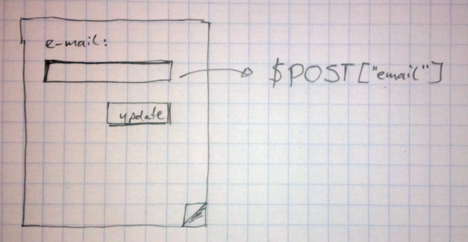

!SLIDE image
# Werking #

!SLIDE code

    @@@SQL
    UPDATE users
      SET
        (email = 'ber@berk.es')
      WHERE id = 1337

!SLIDE code
    @@@PHP
    "UPDATE users
     SET
      (email = '{$POST["email"]}'
      WHERE id = {current_user()->id}"

    $email = $POST["email"];
    $id = current_user()->id;
    "UPDATE users
     SET
      (email = '{$email}'
      WHERE id = {$id}"

!SLIDE code
    @@@PHP
    $POST['email'] =
      "ber@berk.es', role = 'admin"

wordt:

    @@@sql
    UPDATE users
      SET
        (email = 'ber@berk.es', role = 'admin')
      WHERE id = 1337

!SLIDE code

    @@@PHP
    "SELECT * FROM articles
     LIMIT({$per_page}, {$page})"

met: http://example.com/articles?page=12

    @@@PHP
    $page = 
      "12); DROP TABLE payments WHERE (1=1"
    $page =
      "13) INTO OUTFILE '/uploads/data.txt'"
