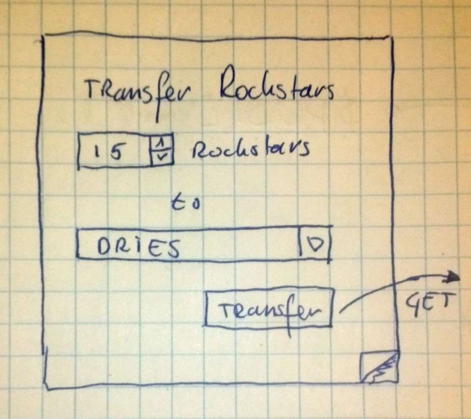

!SLIDE image
# Werking #

`http://example.com/transfer?amount=12&to=1`

!SLIDE code

    @@@HTML
    

!SLIDE code
    @@@javascript
    var xhr = new XMLHttpRequest();
    xhr.open("POST", "http://example.com/transfer/", true);
    xhr.setRequestHeader("Content-type", "application/x-www-form-urlencoded");
    xhr.send("amount=42&to=1337");
