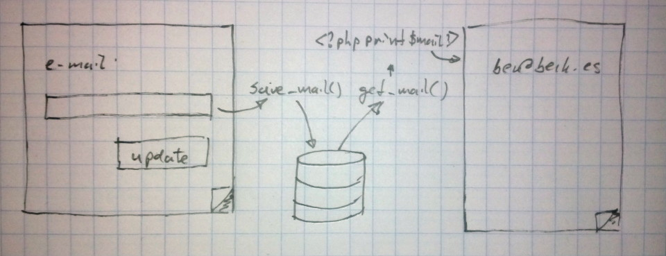

!SLIDE image
# Werking #

    @@@php
    <i><?php print $email ?></i>

!SLIDE code

    @@@html
    ber@berk.es</i><i>

!SLIDE bullets incremental
# Werking #

* Injecteer scripts of andere ongewenste content.

!SLIDE center
<iframe width="960" height="720" src="//www.youtube.com/embed/dQw4w9WgXcQ?autoplay=0" frameborder="0" allowfullscreen></iframe>

!SLIDE bullets incremental
# Soorten #

* Reflected, None-persistent XSS
* Stored, Persistent XSS
* DOM based XSS
* mXSS of mutation XSS

!SLIDE
# Reflected #

    @@@ruby
    "Please check the confirmation at %{email}"

!SLIDE
# Stored #

    @@@ruby
    msg = "Users with changed emails: "
    User.updated(2.days.ago).each do |user|
      msg += "* %{user.email} "
    end

!SLIDE
# DOM based #

    @@@HTML
    <select></select>

Normaal aangeroepen met: `http://www.some.site/page.html?default=French`

Nu aangeroepen met: `http://www.some.site/page.html?default=`

!SLIDE image
# mXSS mutation XSS #

* Gebruikt innerHTML om ge-escapete code te ont-escapen.
* Alle Browserbouwers gingen al de mist in.
* Extra voorzichtig met WYSIWYG-editors, SVG, MathML en CDATA.
